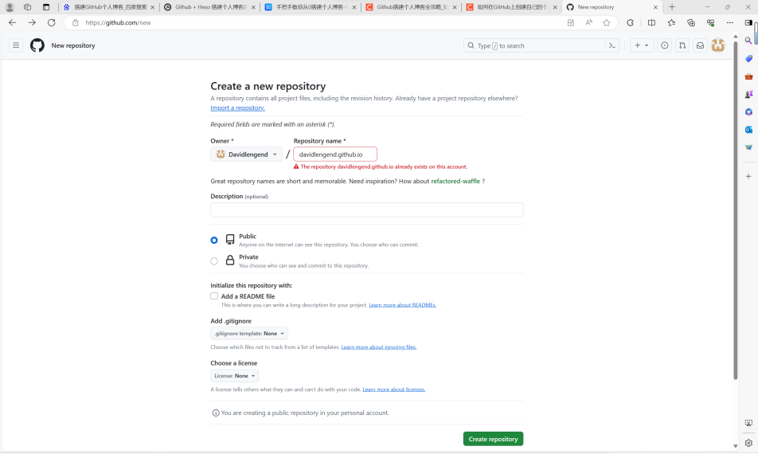
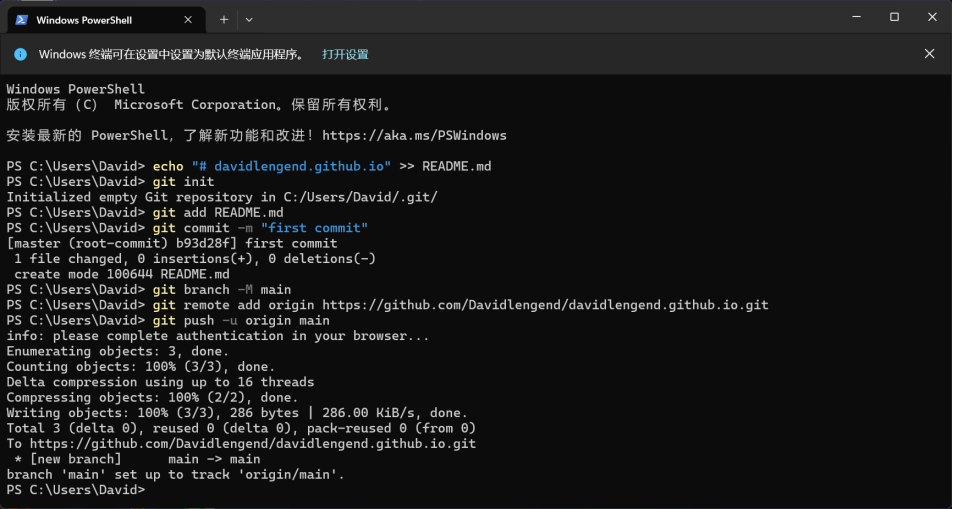
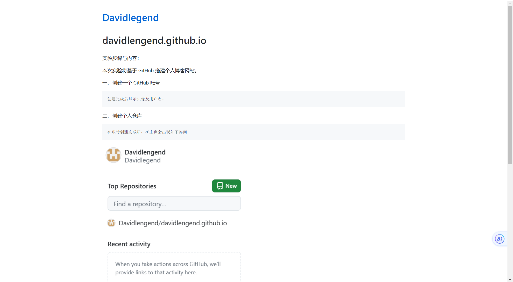

# davidlengend.github.io

实验步骤与内容：

本次实验将基于 GitHub 搭建个人博客网站。

一、创建一个 GitHub 账号

    创建完成后显示头像及用户名。

二、创建个人仓库

    在账号创建完成后，在主页会出现如下界面：

    点击new，新建一个个人仓库，弹出以下界面：

    输入网站名并编辑好网址信息后进行创建。创建完成后可以在仓库内创建一个readme.md文件，创建过程如下图所示：

    创建完成后刷新，仓库内出现了第一个文件，即README.md。可以在该md文件中编写实验报告并呈现在个人主页中，如下图所示。

    结论分析与体会：

    1.在本次实验中，我利用GitHub平台设计并搭建了个人博客网站，并编写了个人博客网站的内容，包括关于我、博客文章、项目展示等。

    2.通过在个人博客网站上创建一个新仓库，将本次实验的报告内容发布到博客网站上，并能够预览和下载。

    3.学习和实践了如何创建个人博客和上传文件，个人博客不仅是展示个人技术能力和项目经验的有效途径，还可以成为与他人交流和学习的平台，在未来可以加以合理利用和有效使用。

附：davidlengend.github.io 为个人网站地址
